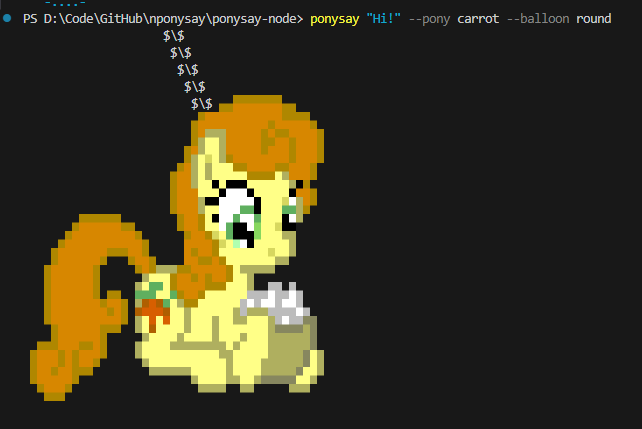

> **Note:** To use `ponysay` as a command, install globally with `npm install -g .` or run `npm link` in the project directory after cloning. This will register the CLI so you can run `ponysay "Friendship is magic!"` directly from your terminal.
## Installation

**Option 1: Install from npm (recommended)**
```bash
npm install -g ponysay-node
```
This will make the `ponysay` command available globally.

**Option 2: Install from a cloned repository (for development or latest features)**
```bash
git clone https://github.com/testudoq-org/nponysay.git
cd nponysay/ponysay-node
npm install
npm link
```
This registers your local version globally, so you can run `ponysay "Friendship is magic!"` from any terminal.

**Option 3: Update an existing clone**
After pulling updates, run:
```bash
npm install
npm link
```
to refresh the global command.

---

Once installed, you can use the standard syntax:
```bash
ponysay "Friendship is magic!"
```
from any terminal, just like the original ponysay tool.

nponysay — cowsay reimplemention for ponies in node.



Today your node, tomorrow the world!


---


# Ponysay Node
**Current:**  
You must run the CLI with:  
```sh
node src/cli.mjs "Hello!" --pony Twilight
```

**After these changes:**  
You can run:  
```sh
ponysay "Hello!" --pony Twilight
```
from any terminal, matching the original ponysay tool's UX.

> Node.js (ES6 `.mjs` modules) implementation of Ponysay with modern asset and balloon rendering.

## Overview

Ponysay Node is a CLI tool for displaying My Little Pony ASCII art with speech/thought balloons. It uses Node.js and ES6 `.mjs` modules for maintainability and extensibility.

## Balloon Rendering with `$balloon5` Sections

Ponysay Node now supports custom balloon rendering using `$balloon5` sections in `.pony` files.

- If a `.pony` file contains a `$balloon5` section, it will be used to render the speech/thought balloon.
- If `$balloon5` is missing or malformed, Ponysay falls back to a generic balloon template.

### Fallback Behavior

- **Present and valid:** `$balloon5` is parsed and used for rendering.
- **Missing or malformed:** The system automatically uses a default balloon (e.g., cowsay or unicode style).

## Message Injection and Formatting

- The message is injected into the balloon at the designated placeholder in `$balloon5`.
- ANSI color codes in the message are preserved and rendered correctly inside the balloon.
- Alignment (left, center, right) is handled according to the balloon's template or default settings.

## CLI Usage Example

```sh
ponysay-node "Hello, world!" --pony=twilight
```

- If `twilight.pony` has a `$balloon5` section, it will be used for the balloon.
- If not, a generic balloon is used.

### Example with ANSI Colors

```sh
ponysay-node "\x1b[35mPurple text\x1b[0m and normal text" --pony=rarity
```

- ANSI color codes are preserved in the output balloon.

## Notes

- **Legacy Notice:** Only the `$balloon5` section is used for custom balloons; older `$balloon` sections are ignored and considered deprecated.
- **Migration:** Asset maintainers should update legacy assets to use `$balloon5`. See [`memory-bank/asset-migration.md`](ponysay-node/memory-bank/asset-migration.md) for migration steps.
- **Validation:** Always validate `$balloon5` sections for correct formatting. Malformed sections trigger fallback to generic balloons.
- **Actionable Steps for Maintainers:**
  - Review all `.pony` files for `$balloon5` presence.
  - Update legacy `$balloon` sections to `$balloon5`.
  - Test balloons with CLI to ensure correct rendering.
  - Refer to migration documentation for guidance.


This is wponsay-node © 2025 by Testudo is licensed under CC BY-NC-SA 4.0

<a href="https://github.com/testudoq-org/nponysay">wponsay-node</a> © 2025 by <a href="https://www.testudo.co.nz/">Testudo</a> is licensed under <a href="https://creativecommons.org/licenses/by-nc-sa/4.0/">CC BY-NC-SA 4.0</a>
