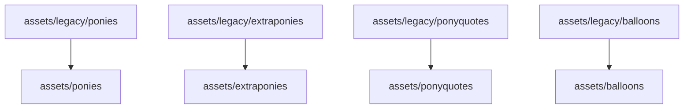

# Ponysay Asset Migration Plan: Legacy to Memory-Bank

This document details the comprehensive migration process for legacy Ponysay assets (`ponies`, `extraponies`, `ponyquotes`, `balloons`) from `assets/legacy/` to the new memory-bank structure. It covers automated scripts, manual steps, validation, edge cases, assumptions, and requirements.

---

> All migrated assets must comply with current standards: ES6 `.mjs` modules, updated metadata, and `$balloon5` sections for balloons. Legacy `$balloon` sections are deprecated.

## 1. Migration Overview

- **Source:** `ponysay-node/assets/legacy/{ponies, extraponies, ponyquotes, balloons}/`
- **Destination:**  
  - `ponysay-node/assets/ponies/`
  - `ponysay-node/assets/extraponies/`
  - `ponysay-node/assets/ponyquotes/`
  - `ponysay-node/assets/balloons/`
- **Reference:** Do not edit Ponysay-master; it is reference only.

---

## 2. Prerequisites & Assumptions

- Node.js and PowerShell (or Bash for Unix) are available.
- You have read/write permissions for all relevant directories.
- All legacy assets are valid and complete.
- Destination folders exist or will be created as part of the migration.
- No files in the destination will be overwritten without review.

---

## 3. Migration Steps

### 3.1. Prepare Destination Folders

- Ensure the following directories exist:
  ```sh
  mkdir -p ponysay-node/assets/ponies
  mkdir -p ponysay-node/assets/extraponies
  mkdir -p ponysay-node/assets/ponyquotes
  mkdir -p ponysay-node/assets/balloons
  ```

### 3.2. Automated Copy/Move

#### PowerShell Example (Windows):

```powershell
$legacyBase = "ponysay-node/assets/legacy"
$destBase = "ponysay-node/assets"

$folders = @("ponies", "extraponies", "ponyquotes", "balloons")
foreach ($folder in $folders) {
    $src = Join-Path $legacyBase $folder
    $dst = Join-Path $destBase $folder
    Write-Host "Migrating $src to $dst ..."
    if (!(Test-Path $dst)) {
        New-Item -ItemType Directory -Path $dst | Out-Null
    }
    Copy-Item $src\* $dst -Recurse -Force
}
Write-Host "Migration complete."
```

#### Bash Example (Unix/macOS):

```bash
for folder in ponies extraponies ponyquotes balloons; do
  src="ponysay-node/assets/legacy/$folder"
  dst="ponysay-node/assets/$folder"
  mkdir -p "$dst"
  cp -r "$src/"* "$dst/"
done
echo "Migration complete."
```

---

### 3.3. Manual Review Points

- **Check for file conflicts:**  
  If a file with the same name exists in the destination, compare contents before overwriting.
- **Validate file formats:**  
  Ensure all `.pony`, `.say`, and quote files conform to expected formats.
- **Review Unicode/encoding:**  
  Open a sample of files in a Unicode-aware editor to check for encoding issues.
- **Spot-check migrated assets:**  
  Randomly open files in each destination folder to confirm integrity.

---

### 3.4. Validation Procedures

- **File count check:**  
  After migration, verify that the number of files in each destination matches the source.
  ```sh
  diff <(ls ponysay-node/assets/legacy/ponies | sort) <(ls ponysay-node/assets/ponies | sort)
  ```
- **Automated test run:**  
  Run unit and E2E tests to ensure assets load and render correctly:
  ```sh
  npx jest
  npx playwright test
  ```
- **Log migration output:**  
  Save script output to a log file for audit and troubleshooting.

---

## 4. Edge Case Handling

- **Unicode/emoji:**  
  Ensure scripts and editors handle Unicode filenames and content.
- **File naming:**  
  Watch for illegal or reserved characters in filenames (especially on Windows).
- **Duplicates:**  
  If duplicate files are found, escalate for manual review.
- **Corrupt/incomplete files:**  
  Flag and quarantine any files that fail to open or parse.

---

## 5. Post-Migration Steps

- Remove or archive the `assets/legacy/` directory only after confirming successful migration and validation.
- Update documentation and references to point to the new asset locations.
- Inform all contributors of the new asset structure.
- Ensure all migrated assets use `$balloon5` for balloons and updated metadata fields.
- Document migration actions and decisions in manual review files and architecture documentation.

---

## 6. Summary Diagram



---

## 7. Requirements

- Node.js environment
- PowerShell (Windows) or Bash (Unix/macOS)
- Sufficient disk space for asset duplication
- Editor with Unicode support for manual review

---

## 8. Assumptions

- No new asset types are introduced during migration.
- All scripts are run from the project root.
- Legacy assets are not modified during migration.

---

## 8. Legacy Feature Decisions

- All legacy `$balloon` sections are deprecated and must be migrated to `$balloon5`.
- Asset metadata must be updated to match current standards.
- Migration actions should be documented for audit and future reference.

## 9. References

- [`ponysay-node/memory-bank/architecture.md`](architecture.md)
- [`ponysay-node/memory-bank/migration-plan.md`](migration-plan.md)
- [`ponysay-node/copy-legacy-assets.ps1`](../copy-legacy-assets.ps1)
